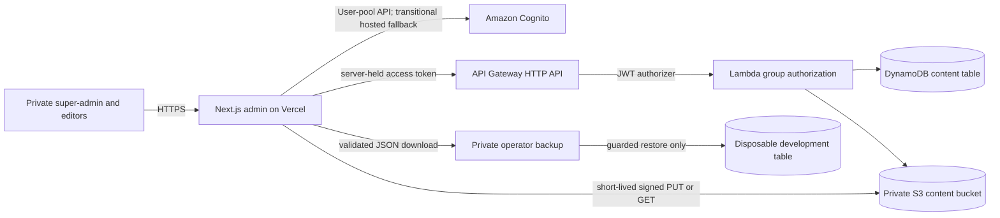

# Architecture

This document describes the current AWS-only production system. Historical
migration decisions are intentionally kept in
[migration-history.md](migration-history.md); operating procedures live in
[operations.md](operations.md).

## System and trust boundaries

The browser trusts only the Next.js origin and a configured exact S3 origin.
It never receives an AWS credential, Cognito refresh token, or Cognito access
token. Next.js is the browser-facing backend-for-frontend (BFF). Cognito, API
Gateway, Lambda, DynamoDB, and S3 form the AWS service boundary. Operator
deployment and recovery commands are outside the application runtime and use a
fresh, temporary AWS session.

## Next.js routes and component boundaries

The App Router exposes four pages:

| Route                   | Entry point                         | Purpose                                                                     |
| ----------------------- | ----------------------------------- | --------------------------------------------------------------------------- |
| `/`                     | `app/page.tsx`                      | Authenticated post list, filters, backup, publication, and delete workflows |
| `/reflexions/new`       | `app/reflexions/new/page.tsx`       | Create a post                                                               |
| `/reflexions/[id]/edit` | `app/reflexions/[id]/edit/page.tsx` | Load and edit one post                                                      |
| `/usuaris`              | `app/usuaris/page.tsx`              | Super-admin user list and invitation controls                               |

The page entries and root layout are Server Components. `app/layout.tsx` reads
the encrypted Cognito session and passes only the safe user projection into the
client `AuthProvider`. Interactive admin, form, authentication, filtering, and
UI components are Client Components. No Client Component imports a server AWS
SDK adapter.

Authentication route handlers are dynamic and uncached:

- `POST /auth/login` checks an email/password through the user-pool API and
  issues encrypted host-only cookies, or stores a short-lived encrypted
  `NEW_PASSWORD_REQUIRED` challenge cookie.
- `POST /auth/new-password` completes the invitation challenge and issues the
  same session cookies. `POST /auth/forgot-password` and
  `POST /auth/confirm-password` provide in-app recovery with generic outcomes.
- `GET /auth/login` and `GET /auth/callback` remain as a transitional operator
  fallback until the replacement is verified in a deployed environment; the
  application UI does not link to them.
- `GET /auth/session` returns only the subject, verified email, normalized group
  memberships, and access expiry; it also rotates refreshed cookies.
- `POST /auth/logout` requires the same origin, revokes the refresh token,
  and clears local cookies without redirecting to a Cognito domain.

The same-origin `/api/aws/*` handlers expose the admin application contract:

| Method and path                            | AWS operation                                                         |
| ------------------------------------------ | --------------------------------------------------------------------- |
| `GET`, `POST /api/aws/posts`               | List or create posts                                                  |
| `GET`, `PUT`, `DELETE /api/aws/posts/[id]` | Read, update, or delete one post                                      |
| `PUT /api/aws/posts/[id]/publication`      | Publish or unpublish one post                                         |
| `POST /api/aws/posts/publication/bulk`     | Publish the confirmed draft set                                       |
| `GET /api/aws/categories`                  | List categories                                                       |
| `GET /api/aws/keywords`                    | List keywords, optionally by language                                 |
| `GET /api/aws/posts/[id]/images`           | Inspect attached private images                                       |
| `POST /api/aws/posts/[id]/images/presign`  | Create a checksum-bound upload intent                                 |
| `POST /api/aws/posts/[id]/images/confirm`  | Verify and attach an upload                                           |
| `DELETE /api/aws/posts/[id]/images/[role]` | Detach main or thumbnail image                                        |
| `GET /api/aws/backup`                      | Download a validated DynamoDB backup                                  |
| `GET`, `POST /api/aws/users`               | List users or invite an editor                                        |
| `POST /api/aws/users/[username]/actions`   | Resend invitation, reset password, enable/disable, or revoke sessions |

Reads and mutations validate the local Cognito session, attach the access token
server-side, forward a correlation ID, and return `Cache-Control: no-store`.
Mutations additionally require exact same-origin requests; JSON requests are
capped at 256 KiB and require `application/json`. Conditional versions and
idempotency keys prevent lost updates and duplicate retries.

## Authentication and authorization

Cognito self-sign-up is disabled. The public client has no secret, supports
Authorization Code with PKCE for the transitional fallback, and permits
`USER_PASSWORD_AUTH` plus refresh-token authentication for the in-app flow.
The `super-admins` and `editors` groups can perform content operations; only
`super-admins` are eligible for user-management operations. The legacy
`admintonibover-api/admin` scope remains available to the hosted login during
the transition but is not an authorization requirement.

User administration is enforced in the Lambda after JWT validation. The
browser-facing Next.js routes hold no AWS credentials. The Lambda role grants
only the required Cognito admin actions on this stack's exact user-pool ARN.
An invitation is first created with delivery suppressed, then assigned to
`editors`, then sent by Cognito; no temporary password enters the response or
logs. The account list is paginated and may briefly lag a write because Cognito
`ListUsers` is eventually consistent. Self-disable is rejected using the
authenticated subject, and disabling a user also attempts global sign-out.

CloudFormation takes the existing administrator's private Cognito username as
a no-echo deployment parameter. The Lambda and protected API routes depend on
that user's `super-admins` attachment, so group enforcement cannot update
before the initial membership exists.

State, nonce, verifier, invitation challenge, access token, ID token, and refresh token are encrypted
and authenticated in host-only, HttpOnly, SameSite=Lax cookies; production
cookies are Secure.

Every accepted session verifies signature, issuer, audience/client, token use,
subject, nonce where applicable, expiry, and verified email, then normalizes the
`cognito:groups` claim. Cognito `GetUser` verifies that the access token remains
active, so revocation or global sign-out closes the local session window. API
Gateway repeats JWT validation. Lambda repeats issuer, client, token-use, and
subject checks, then requires `super-admins` or `editors`; a valid token without
an allowed group receives `403`.

`proxy.ts` applies the Content Security Policy, framing denial, MIME-sniffing
protection, referrer policy, permissions policy, opener isolation, and
production HSTS. CSP and AWS CORS accept exact origins only; production HTTP,
paths, credentials, queries, fragments, and wildcards are rejected.

## AWS service boundary

`infra/dev-foundation.ts` deterministically produces isolated `dev` and `prod`
CloudFormation templates. Each environment has one Cognito User Pool/client/
domain/resource server, `super-admins` and `editors` groups, one HTTP API and
JWT authorizer, one arm64 Node.js 24 Lambda, one on-demand DynamoDB table, one
private S3 bucket, and a 14-day Lambda log group. The API stage is throttled at
two requests per second with a burst of four; Lambda has no VPC, reserved
concurrency, or provisioned concurrency.

The Lambda role is limited to the exact table and approved S3 prefixes. The S3
bucket blocks all public access, enforces bucket ownership and TLS, uses SSE-S3,
and expires abandoned `temporary/` uploads after one day. Production DynamoDB
and Cognito deletion protection are enabled. Production data-bearing resources
use retention policies so a stack change cannot silently destroy them.

## DynamoDB model

The table has string `PK` and `SK` keys, Standard table class, on-demand
capacity, no GSI/LSI, and no streams. Current item types are:

| Entity              | Key                                        | Purpose                                                                |
| ------------------- | ------------------------------------------ | ---------------------------------------------------------------------- |
| `POST`              | `POST#<id>` / `POST#<id>`                  | Canonical bilingual aggregate, image metadata, timestamps, and version |
| `REFERENCE_SEGMENT` | `POST#<id>` / `REFS#<language>#<sequence>` | Ordered overflow references                                            |
| `POST_SUMMARY`      | `POSTS` / `ORDER#...#POST#<id>`            | Bounded list/filter/pagination projection                              |
| `SLUG_LOCK`         | `SLUG#<language>#<slug>` / `LOCK`          | Unique bilingual slug ownership                                        |
| `CATEGORY`          | taxonomy keys                              | Bilingual category catalog                                             |
| `KEYWORD`           | taxonomy keys                              | Language-specific keyword catalog                                      |
| `DATA_REVISION`     | `SYSTEM` / `REVISION`                      | Monotonic backup-consistency marker                                    |
| `IDEMPOTENCY`       | request digest keys                        | 24-hour retry result/progress record                                   |
| `MEDIA_UPLOAD`      | upload keys                                | Short-lived upload intent                                              |

Reads are strongly consistent and paginated. A post normally stores references
inline; at the 350 KiB safety guard they move into bounded ordered segments.
Writes fail before AWS if the aggregate, segment, 100-action transaction, or
4 MiB transaction limit cannot be met. Aggregate, summary, slug locks,
segments, catalog changes, revision, and idempotency state change atomically.

## Images

Accepted JPEG, PNG, WebP, and AVIF files are limited to 5 MiB. Lambda validates
the post/version, role, MIME type, extension, size, and SHA-256, then returns a
five-minute presigned PUT for an opaque temporary key. The browser uploads
directly with only the signed content-type and checksum headers. Confirmation
uses `HeadObject`, copies to the owned post/role prefix, and conditionally
stores only the key and metadata. The previous object is deleted only after the
DynamoDB transaction succeeds; failed cleanup remains observable and retryable.
Private previews use five-minute presigned GET URLs and URLs are never stored.

## Backup and recovery

The protected backup path strongly scans DynamoDB, excludes transient
`IDEMPOTENCY` and `MEDIA_UPLOAD` records, sorts items, and returns the v2 schema,
entity counts, revision, page count, and SHA-256 digest. Lambda validates the
document; the browser validates it again and binds the filename to environment
and export time.

Recovery accepts only a new, empty, tagged, on-demand development table with
the exact string `PK`/`SK` schema. The command requires a confirmation bound to
the archive digest, run ID, AWS account, Region, and table; production-looking
targets are refused. Writes use batches of at most 25 with bounded retry of
unprocessed items, followed by a strong full scan, digest/count/revision
comparison, and representative repository reads. It never merges into the
active table or restores S3 objects.

## Deployment inputs and validation

The proposed read-only Astro build interface and its separate IAM boundary
are specified in [site-build-reader-contract.md](site-build-reader-contract.md).
It is a development staging contract; no reader resource is deployed yet.

Source inputs are `infra/dev-foundation.ts`, `infra/lambda/foundation.ts`, the
parameter examples, and the pinned dependency graph. `pnpm infra:synth`
produces the inline Lambda bundle and environment template in
`infra/generated/`; both are committed because they are the exact reviewable
CloudFormation upload inputs, while `pnpm infra:validate` proves they are
byte-for-byte reproducible. Environment-specific parameter files stay private.

CI uses pinned Node, pnpm, Python, GitHub Actions, and cfn-lint. It performs a
frozen-lockfile install, dependency review/audit, secret scan, CloudFormation
schema validation, infrastructure contract validation, lint, typecheck, unit
tests, production build with inert secret canaries, and browser-artifact scan.

## Security and cost posture

The design has no public S3 data, long-lived application AWS key, VPC/NAT,
CloudFront, WAF, DAX, stream, queue, scheduled job, customer KMS key,
provisioned capacity, or provisioned concurrency. Costs are request/storage
based across API Gateway, Lambda, DynamoDB, S3, Cognito, and CloudWatch. The
account uses `eu-west-1`, root/operator MFA, no root access keys, budgets and
cost-anomaly email alerts, and mandatory `Project`, `Environment`, `ManagedBy`,
and `Owner` tags. Alerts are warnings rather than spending caps; unexpected
cost or resources require operator action.
